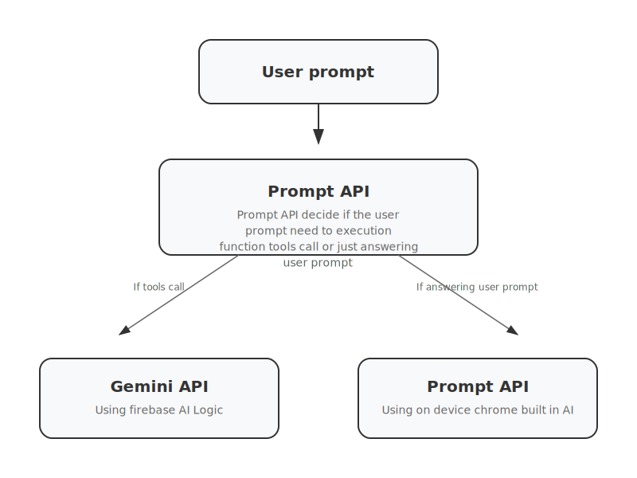

# Beautiful Schedule Maker

An AI-powered timetable management application with integrated note-taking capabilities. Create, manage, and visualize class schedules using natural language input, while keeping organized notes with visual drawing capabilities.

## Features

### 🤖 AI-Powered Course Management
- Add, edit, and delete courses using conversational AI
- Natural language input: "Add Math 101 on Monday and Wednesday from 2-3 PM"
- Intelligent parsing of course codes, times, and locations
- Chrome AI and Firebase AI integration for enhanced course management

### 📅 Visual Timetable Display
- Interactive weekly schedule view with customizable styling
- Mobile-responsive design with device-specific sizing
- Export capabilities (PNG, JPEG, SVG formats)
- Device-specific preview modes for various phone models
- Customizable backgrounds and wallpapers

### 📝 Advanced Note-Taking System

#### Excalidraw Visual Notes
- **Full Excalidraw Integration**: Complete visual note-taking with drawing capabilities
- **Scene Persistence**: Automatic saving of drawing scenes to local storage
- **Three-View System**: Seamless transitions between timetable, note list, and editor views
- **iOS-Inspired Design**: Beautiful note cards with Apple-quality typography
- **Floating Action Button**: Quick note creation with smooth interactions
- **Auto-Save**: Changes automatically saved with user feedback

#### Rich Text Editor
- **Tiptap Integration**: Full-featured rich text editing
- **Formatting Support**: Headings, lists, code blocks, and blockquotes
- **Character Count**: Real-time character counting and limits
- **Placeholder Text**: Helpful prompts for content creation

### 🔐 Data Persistence
- **IndexedDB Storage**: Local browser storage for offline support
- **Zustand State Management**: Efficient state management with persistence

### 🎨 Customization Features
- **Wallpaper Selection**: Multiple background options
- **Device Preview**: Preview timetables on various device models
- **Responsive Layouts**: Automatic adaptation to different screen sizes
- **Theme Support**: Built-in theming capabilities

## Getting Started

### Prerequisites
- Node.js 18+ 
- npm, yarn, pnpm, or bun

### Installation

1. Clone the repository:
```bash
git clone <repository-url>
cd beautifulschedulemaker
```

2. Install dependencies:
```bash
npm install
```

3. Run the development server:
```bash
npm run dev
```

4. Open [http://localhost:3000](http://localhost:3000) with your browser.

## Usage

### Managing Courses
- **AI Chat Interface**: Use natural language to add courses: "Add CSC 1100 Elements of Programming on Monday and Wednesday from 2:00 PM to 3:20 PM in ICT Lab 7"
- **Manual Mode**: Toggle to traditional button controls for direct course management
- **Course Dialogs**: Add, edit, and delete courses through intuitive dialogs
- **JSON Import/Export**: Bulk import courses via JSON format

### Taking Notes
- **Visual Notes**: Create drawings and visual notes using Excalidraw
- **Note Management**: Organize notes with titles and automatic saving
- **Three-View Navigation**: 
  - Timetable view with "Add Note" button
  - Note list view with card-based interface
  - Full-screen note editor with drawing capabilities

### Customization
- **Backgrounds**: Select from multiple wallpaper options
- **Device Preview**: Preview your timetable on different device models
- **Export Options**: Download timetables in PNG, JPEG, or SVG formats
- **Settings**: Comprehensive settings for personalization

## Technology Stack

### Frontend
- **Next.js 15.2.4** - React framework with App Router
- **React 18.3.1** - UI library with TypeScript
- **Tailwind CSS 4.1.2** - Utility-first CSS framework
- **Radix UI** - Headless UI components for accessibility
- **Framer Motion 11.18.2** - Animation library

### Note-Taking & Drawing
- **@excalidraw/excalidraw 0.18.0** - Visual drawing and note-taking
- **@tiptap/react 3.4.1** - Rich text editor
- **@tiptap/starter-kit 3.4.1** - Essential Tiptap extensions

### AI Integration
- **@built-in-ai/core 2.0.0** - Chrome AI integration
- **Firebase 12.4.0** - AI services and backend integration

### State Management & Storage
- **Zustand 5.0.3** - Lightweight state management
- **IndexedDB** - Local browser storage for offline support

### UI Components & Utilities
- **Lucide React 0.469.0** - Icon library
- **date-fns 4.1.0** - Date manipulation utilities
- **html-to-image 1.11.13** - Screenshot and export functionality
- **react-colorful 5.6.1** - Color picker components
- **sonner 2.0.6** - Toast notifications

### Development & Testing
- **TypeScript 5** - Type safety and development experience
- **Vitest 3.2.4** - Testing framework
- **@testing-library/react 16.3.0** - Component testing utilities

## Architecture

### Dual AI Chatbot Architecture



The application features a sophisticated dual AI system that combines Chrome's built-in AI capabilities with Firebase AI (Gemini) to provide intelligent course management:

#### Chrome Built-in AI Integration
- **Client-Side Processing**: Uses Chrome's native `window.ai.languageModel` API for on-device AI processing
- **Privacy-First**: All processing happens locally in the browser without sending data to external servers
- **Real-Time Availability**: Checks for Chrome AI availability and handles model downloading/initialization
- **Streaming Responses**: Implements `promptStreaming()` for real-time response generation
- **Session Management**: Creates and manages language model sessions with proper cleanup

```typescript
// Chrome AI Implementation
const session = await window.ai.languageModel.create();
const stream = session.promptStreaming(prompt);
for await (const chunk of stream) {
  // Handle streaming response
}
```

#### Firebase AI (Gemini) Integration
- **Intent Classification**: Uses Firebase AI's `ONLY_ON_DEVICE` mode to determine user intent
- **Tool Calling**: Implements function calling for course management operations
- **Dual Model Strategy**: 
  - On-device model for intent classification and simple responses
  - Cloud model for complex tool-calling operations
- **Structured Responses**: Uses JSON schema constraints for reliable intent detection


#### Intelligent Request Routing
The system uses a two-step decision process:

1. **Intent Analysis**: Chrome AI or Firebase on-device model analyzes user input to determine if it requires:
   - `tool-call`: Course management operations (add/edit/delete courses)
   - `answer-prompt`: General conversation or information requests

2. **Model Selection**: Based on intent classification:
   - **Tool Operations**: Routes to Firebase AI with function calling capabilities
   - **General Chat**: Uses Chrome AI for privacy-focused local processing

#### Function Calling System
The chatbot implements a comprehensive tool system for course management:

```typescript
const timetableTool: FunctionDeclarationsTool = {
  functionDeclarations: [
    {
      name: "addCourse",
      description: "Create a new course with sessions",
      parameters: Schema.object({
        properties: {
          timetableId: Schema.string(),
          course: Schema.object({
            // Course structure definition
          })
        }
      })
    },
    // Additional tools for getCourses, updateCourse, deleteCourse
  ]
};
```

#### Available Tool Functions

The timetableTool provides the following function calls for course and timetable management:

| Function Name | Description | Required Parameters | Optional Parameters |
|---------------|-------------|-------------------|-------------------|
| **Course Management** |
| `getCourses` | Return all courses for a given timetable | `timetableId` | - |
| `addCourse` | Create a new course with sessions under a timetable | `timetableId`, `course` | - |
| `updateCourse` | Update an existing course and its sessions | `timetableId`, `courseId`, `updates` | - |
| `deleteCourse` | Delete a course from a timetable | `timetableId`, `courseId` | - |
| `resetCourses` | Remove all courses from state | - | - |
| **Timetable Management** |
| `addTimetable` | Create a new timetable (auto-named, set as active) | - | - |
| `setActiveTimetable` | Set the currently active timetable by ID | `id` | - |
| `updateTimetable` | Replace an existing timetable with provided object | `updatedTimetable` | - |
| `getTimetable` | Fetch a single timetable by ID | `id` | - |
| `getTimetables` | Return all timetables | - | - |
| `getTimetableActiveId` | Get the currently active timetable ID | - | - |
| `updateMany` | Batch update multiple timetables | `updates` | - |
| `deleteTimetable` | Delete a timetable by ID | `id` | - |

**Parameter Details:**
- `timetableId`: String - The ID of the target timetable
- `courseId`: String - The ID of the target course
- `course`: Object - Complete course object with sessions
- `updates`: Object - Partial course/timetable data for updates
- `updatedTimetable`: Object - Full timetable object with required `id` field
- `id`: String - Timetable or course identifier

#### Error Handling & Fallbacks
- **Graceful Degradation**: Falls back to alternative AI providers if primary fails
- **Availability Checking**: Continuously monitors Chrome AI availability
- **Model Download Progress**: Tracks and displays Chrome AI model download status
- **Session Recovery**: Handles session timeouts and reconnections

### Component Structure
```
app/
├── api/                    # API routes for AI integration
├── excalidraw-demo/        # Excalidraw demonstration page
├── layout.tsx             # Root layout with providers
└── page.tsx               # Main application interface

components/
├── ui/                    # Reusable UI components (Radix-based)
├── chatbot.tsx            # AI conversation interface
├── timetable.tsx          # Visual schedule display
├── course-dialog.tsx      # Course management dialogs
├── excalidraw-note-editor.tsx # Excalidraw integration
├── note-list-view.tsx     # Note list interface
├── add-note-button.tsx    # Note creation button
├── settings-area.tsx      # Application settings
├── wallpaper-selection-dialog.tsx # Background customization
└── error-boundary.tsx     # Error handling component

stores/
├── timetableStore.ts      # Timetable and schedule management
├── courseStore.ts         # Course CRUD operations
├── chatStore.ts           # AI chat state management
├── excalidrawNoteStore.ts # Note and drawing persistence
├── settingsStore.ts       # Application settings
├── sidebarStore.ts        # Sidebar state management
└── types.ts               # TypeScript interfaces

lib/
├── firebase.ts            # Firebase configuration
├── chrome-ai.ts           # Chrome AI integration
├── course-timetable-helpers.ts # Course management utilities
├── excalidraw-notes-utils.ts # Excalidraw utilities
├── mock-notes-data.ts     # Development data
└── utils.ts               # General utilities
```

### Data Flow
1. **User Input** → Direct UI interaction or AI chat
2. **State Updates** → Zustand stores with automatic persistence
3. **Local Storage** → IndexedDB with offline support
4. **UI Updates** → React components with optimistic updates

## Learn More

To learn more about the technologies used:

- [Next.js Documentation](https://nextjs.org/docs) - React framework features and API
- [Excalidraw Documentation](https://docs.excalidraw.com/) - Visual drawing and note-taking
- [Zustand Documentation](https://zustand-demo.pmnd.rs/) - State management
- [Tailwind CSS](https://tailwindcss.com/docs) - Styling framework
